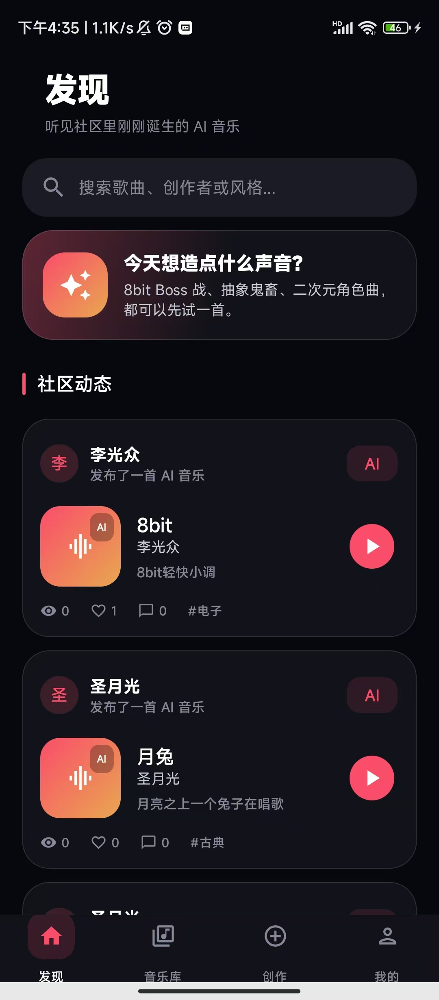
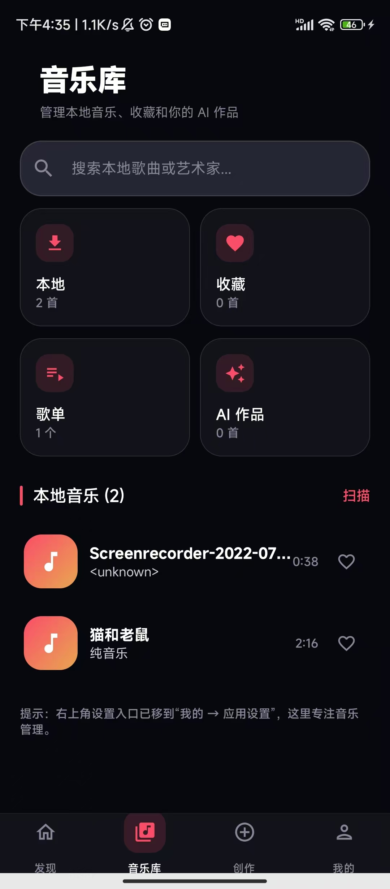
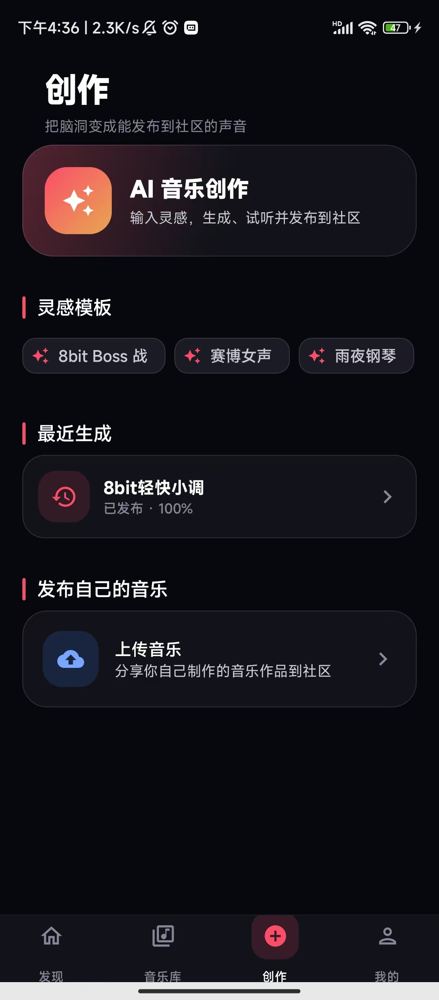
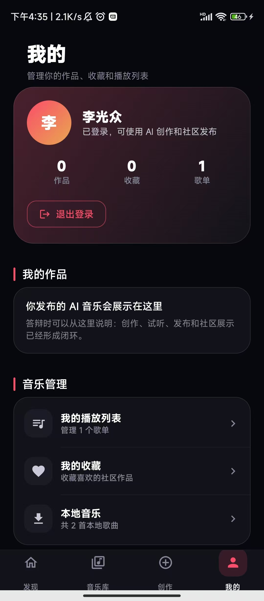
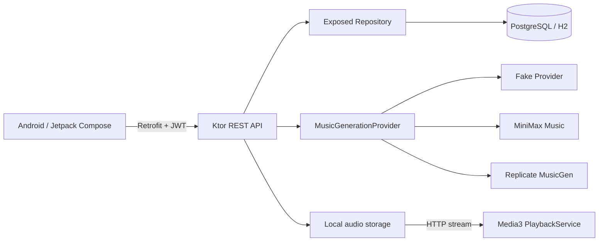

# 织音 WeaveTone — AI 音乐创作与社区平台

织音取“编织声音”与“寻找知音”之意，是一个面向 Android 的全栈 AI 音乐项目：用户可以用自然语言提交音乐生成任务，试听生成结果并发布到社区，也可以上传本地作品、点赞评论、收藏和维护歌单。

项目不是“在客户端直接调用一次 AI API”的演示，而是实现了可替换的模型 Provider、持久化任务状态、服务端音频落盘和社区发布闭环。仓库内置 Fake Provider，无需 API Key 也能完整演示业务流程。

## Screenshots

<table>
  <tr>
    <td></td>
    <td></td>
    <td></td>
    <td></td>
  </tr>
  <tr>
    <td align="center">社区发现</td>
    <td align="center">音乐库</td>
    <td align="center">AI 创作</td>
    <td align="center">个人中心</td>
  </tr>
</table>

## 功能闭环

- AI 创作：提示词、风格、BPM、时长参数，任务轮询与历史恢复
- Provider 架构：Fake、MiniMax Music、Replicate MusicGen 可通过环境变量切换
- 结果持久化：生成成功后由后端保存音频，不依赖供应商临时 URL
- 音乐社区：作品发布、流式播放、真实点赞、评论与收藏列表
- 作品管理：AI 生成历史、已发布作品、本地音频上传
- 歌单管理：创建/删除歌单、添加/移除歌曲、歌单详情
- Android 播放：Media3 后台播放服务、迷你播放器与完整播放页
- 本地音乐库：MediaStore 扫描、Room 缓存和搜索
- 用户系统：JWT 登录注册、中文用户名、登录状态持久化

## 技术栈

| 客户端 | 服务端 | 数据与基础设施 |
| --- | --- | --- |
| Kotlin, Jetpack Compose, Material 3 | Kotlin, Ktor 3, kotlinx.serialization | PostgreSQL / H2, Exposed, HikariCP |
| Hilt, Retrofit, OkHttp | JWT, BCrypt, CORS, Rate Limit | 本地音频存储、环境变量密钥管理 |
| Room, Media3, Coil, Coroutines | Provider Strategy + 异步任务 | Gradle, GitHub Actions |

## 架构概览



生成任务状态统一为 `PENDING → RUNNING → SUCCEEDED → PUBLISHED`，异常进入 `FAILED`。Android 每 2 秒轮询状态，任务和错误写入数据库，因此离开页面或重启应用后仍可恢复。

更详细的设计见 [架构说明](docs/ARCHITECTURE.md) 和 [API 概览](docs/API.md)。

## Docker 一键部署

后端、PostgreSQL、健康检查和持久化卷已编排在 `docker-compose.yml` 中。安装 Docker Desktop 后执行：

```powershell
Copy-Item .env.docker.example .env
docker compose up --build -d --wait
Invoke-RestMethod http://127.0.0.1:8080/ready
```

返回 `status: UP` 即表示应用和数据库均已就绪。默认使用 Fake Provider，无需模型 API Key；公开部署前必须修改 `.env` 中的数据库密码和 `JWT_SECRET`。停止服务使用 `docker compose down`，同时清空演示数据使用 `docker compose down -v`。

CI 会真实构建镜像、启动 Compose 栈并请求 `/ready`，防止“一键部署”文档与代码漂移。完整配置、数据卷和故障排查见 [部署指南](docs/DEPLOYMENT.md)。

## 5 分钟本地运行

### 1. 环境

- Android Studio + Android SDK 35
- JDK 17
- Windows 可直接使用仓库内的 Gradle Wrapper

### 2. 启动后端（无需 API Key）

双击：

```text
backend/run_backend.bat
```

它会使用 H2 文件数据库和 Fake Provider，监听 `0.0.0.0:8080`。浏览器访问 `http://127.0.0.1:8080/health`，返回 `status: UP` 即启动成功。

也可以在 PowerShell 中运行：

```powershell
cd backend
$env:AI_PROVIDER="fake"
$env:DB_URL="jdbc:h2:file:./data/aimusic_demo;MODE=PostgreSQL;DATABASE_TO_LOWER=TRUE"
.\gradlew.bat run
```

### 3. 配置 Android 后端地址

默认地址是 Android 模拟器使用的 `http://10.0.2.2:8080/`。真机调试时，把下面一行加入本机的 `local.properties`（不要提交该文件）：

```properties
BACKEND_BASE_URL=http://你的电脑局域网IP:8080/
```

USB 调试也可以先运行：

```powershell
adb reverse tcp:8080 tcp:8080
```

然后配置 `BACKEND_BASE_URL=http://127.0.0.1:8080/`。更多示例见 [local.properties.example](local.properties.example)。

### 4. 构建 Android

```powershell
.\gradlew.bat :app:assembleDebug
```

或直接在 Android Studio 中运行 `app`。

## 使用真实 AI 服务

API Key 只放在 Ktor 后端环境变量中，不会进入 APK、日志或 Git。

MiniMax（Windows）：

```text
backend/run_backend_minimax_prompt.bat
```

脚本会在当前终端中安全读取 `MINIMAX_API_KEY`。也可手动设置：

| 变量 | 示例/说明 |
| --- | --- |
| `AI_PROVIDER` | `fake`、`minimax` 或 `replicate` |
| `MINIMAX_API_KEY` | MiniMax 平台密钥 |
| `MINIMAX_MODEL` | 默认 `music-2.6-free` |
| `REPLICATE_API_TOKEN` | Replicate 密钥 |
| `JWT_SECRET` | 生产环境必须设置的随机长字符串 |
| `DB_URL` | PostgreSQL 或 H2 JDBC URL |
| `DB_USER` / `DB_PASSWORD` | 数据库凭据 |

> Fake Provider 生成的是可播放的演示音频，用于离线答辩和自动化测试；真实音乐质量取决于所选模型及账户额度。

## 工程亮点

1. **AI 服务解耦**：用 `MusicGenerationProvider` 隔离供应商差异，业务路由无需感知 MiniMax/Replicate 的请求格式。
2. **可靠的生成闭环**：任务状态、进度、供应商任务 ID、错误和音频路径全部持久化，并限制单用户并发任务。
3. **客户端不持有模型密钥**：Android 只访问自己的 Ktor API，降低 APK 反编译导致的密钥泄漏风险。
4. **弱网可恢复**：页面重新进入后从后端恢复最近任务，而不是依赖一次网络请求的内存状态。
5. **可离线演示**：H2 + Fake Provider 让招聘者克隆仓库后无需申请第三方服务即可体验完整流程。

## 项目结构

```text
app/                     Android 客户端
  src/main/java/...      Compose UI、ViewModel、Repository、播放服务
backend/                 Ktor 服务端（独立 Gradle 工程）
  src/main/kotlin/...    路由、数据表、鉴权、AI Provider
docs/                    架构、API、演示与简历材料
```

## 当前边界

- 当前音频存储为服务端本地目录，生产部署应替换为对象存储/CDN。
- Rate Limit 为单实例内存实现，多实例部署应使用 Redis。
- 数据库仍使用 Exposed 自动建表，生产环境应引入 Flyway/Liquibase。
- MiniMax/Replicate 属于外部付费服务，接口可用性与模型条款以供应商为准。

答辩或面试演示步骤见 [DEMO.md](docs/DEMO.md)，可直接用于简历的项目描述见 [RESUME.md](docs/RESUME.md)。

自动化测试覆盖 19 个核心用例，测试分层与权限/一致性矩阵见 [TESTING.md](docs/TESTING.md)，最近一次完整验收证据见 [VERIFICATION.md](docs/VERIFICATION.md)。推送 `v1.0.0-demo` Tag 会自动测试并发布 APK、后端分发包和 SHA-256 校验文件；准备公开仓库时请核对 [GitHub 发布清单](docs/RELEASE_CHECKLIST.md)、[Release Notes](docs/RELEASE_NOTES_v1.0.0-demo.md) 与 [CHANGELOG](CHANGELOG.md)。安全约定见 [SECURITY.md](SECURITY.md)。
