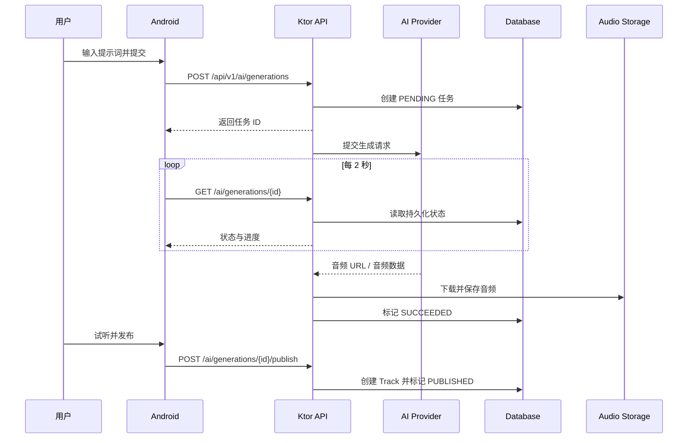
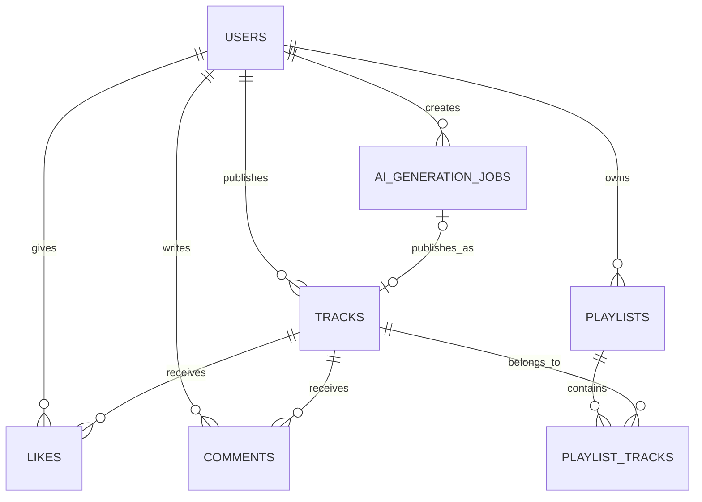

# 架构说明

## 设计目标

项目围绕两个同等重要的核心域组织：AI 音乐创作和音乐社区。客户端不直接调用模型厂商；所有生成任务、状态、音频和发布关系都由自己的后端管理。

## 系统边界



## Android 分层

- **UI**：Jetpack Compose 页面和复用组件，负责渲染状态与派发用户事件。
- **ViewModel**：将提交、轮询、恢复、发布、点赞、评论和歌单操作建模为可观察状态。
- **Repository**：统一访问 Retrofit API、Room 和 MediaStore，并把后端相对音频地址转换为可播放 URL。
- **PlaybackService**：基于 Media3 的后台播放与媒体会话，页面只操作播放器状态。
- **Security**：JWT 使用加密偏好保存；供应商 API Key 不进入客户端。

## Ktor 分层

- **Routes**：认证、曲目、社交、歌单、搜索和 AI 任务 REST API。
- **Middleware/Config**：状态码映射、序列化、CORS、限流、JWT 校验和数据库连接池。
- **Provider**：`MusicGenerationProvider` 定义提交、查询状态和下载音频三项能力。
- **Persistence**：Exposed 表模型保存用户、曲目、AI 任务、点赞、评论、歌单、播放历史和关注关系。

## Provider 可替换性

```kotlin
interface MusicGenerationProvider {
    val name: String
    suspend fun submit(request: ProviderGenerationRequest): ProviderSubmission
    suspend fun getStatus(providerTaskId: String): ProviderStatus
    suspend fun downloadAudio(outputUrl: String?, target: File)
}
```

`AI_PROVIDER` 决定运行时实现：

- `fake`：离线生成可播放演示音频，适合开发、CI 和答辩兜底。
- `minimax`：调用 MiniMax Music，同步结果被适配为统一任务状态。
- `replicate`：调用托管 MusicGen，轮询 prediction 状态。

未来接入 Python GPU Worker 或角色翻唱服务时，只需新增 Provider，不需要修改 Android API 契约。

## 数据模型



## 安全与部署边界

- 模型密钥和数据库凭据只从环境变量读取。
- Debug 构建允许局域网 HTTP，Release 网络策略默认禁止明文流量。
- JWT 密钥未配置时仅允许开发回退并打印警告；公开部署必须设置 `JWT_SECRET`。
- 上传内容和外部音频仍需在生产版增加病毒扫描、对象存储签名 URL 和内容审核。

## 权限与一致性策略

- 资源级鉴权：JWT 只证明用户身份，路由还会校验 Track、Playlist、AI Job 的 `userId`，私有歌单和播放历史不对其他用户开放。
- 关系唯一性：点赞、关注和歌单曲目使用联合主键，数据库拒绝重复关系。
- 原子写入：点赞切换先锁定曲目行，再同时更新关系表与冗余计数；AI 任务发布在单个事务内锁定任务、创建 Track 并推进状态，重复请求只返回原 Track。
- 级联清理：删除作品时在同一事务清理点赞、评论、播放历史与歌单关系；删除歌单先清理关联表，避免孤儿记录。
- 输入边界：限制标题、评论、描述、标签、BPM 与上传文件大小/扩展名，上传文件名使用 UUID，避免目录穿越和同名覆盖。
